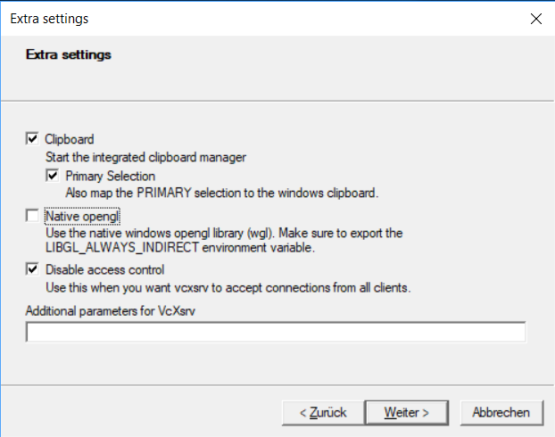

# Instructions for Docker 

The following readme gives a short introduction on how to use the docker container on Linux and on Windows.   
Note that it is not possible to communicate with other hosts (e.g. Turtlebot) via wifi nor lan.


## Prequisites

1. Install docker (here are the instructions: [link](https://docs.docker.com/install/linux/docker-ce/ubuntu/) )
2. Copy the downloaded files to a destination of your choice. e.g. ~/Documents/Docker/FHTW/

### Windows only

3. Install VcXsrv as X11-Server: (link)[https://sourceforge.net/projects/vcxsrv/files/latest/download]   
Make sure that you allow VcXsrv access to public and private networks


## Linux

1. Now you can either build the container from source or pull it from the docker hub
    1. Build:
    ```
    cd ~/Documents/Docker/FHTW
    docker build -t "fhtw/ros-melodic" --rm .
    ```

    2. Pull:

    ```
    docker pull fhtw/ros-melodic
    ```

2. To start the docker container execute the following commands:

```
cd ~/Documents/Docker/FHTW
chmod +x run_fhtw_ros.sh
```

## Windows

1. Now you can either build the container from source or pull it from the docker hub
    1. Build:
        1. Navigate to the downloaded folder using file explorer
        2. Double klick on [build_docker_container.bat](./build_docker_container.bat)
    2. Pull:
    Open Powershell and execute:
    ```
    docker pull fhtw/ros-melodic
    ```
2. Start VcXsrv (XLaunch) with following configuration:   



2. To start the docker container double klick on [run_docker.bat](./run_docker.bat)   
On the first start docker will ask for permissions to mount catkin_ws/src folder (for more see below).

## Development inside the Docker Container

To make it easier to develope within the docker container, the folder "catkin_ws/src/" (which is located directly on your computer) is mounted into the docker container under "/home/fhtw_user/catkin_ws/src". This allows you to save your projects. Please use a USB stick or the volume of your fhtw users.

If you want to work with a IDE we recommand to use Visual Studio Code and the Remote Development (ms-vscode-remote.vscode-remote-extensionpack) Plugin.
Further to work with ROS we recommend the ROS (ms-iot.vscode-ros) Plugin.